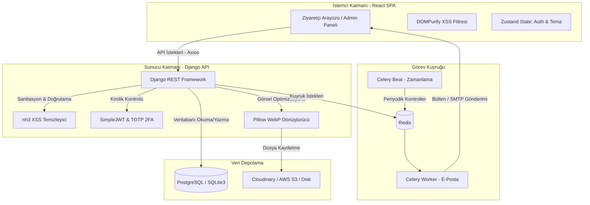

# Akalın Portfolyo & Headless CMS

[](https://djangoproject.com)
[](https://react.dev)
[](https://typescriptlang.org)
[](https://tailwindcss.com)
[](https://vite.dev)
[](https://docs.celeryq.dev)
[](LICENSE)

Django REST Framework (Python) + React 19 (TypeScript) + Tailwind CSS v4 ile geliştirilmiş; Türkçe-İngilizce çoklu dil (i18n) destekli, GrapesJS sürükle-bırak görsel editörü ile güçlendirilmiş, iki katmanlı XSS korumasına sahip, gelişmiş kişisel portfolyo ve içerik yönetim sistemi (CMS).

---

## 🚀 Proje Genel Bakış

Bu proje, modern bir yazılım geliştiricinin tüm portfolyo, makale yayınlama, bülten yönetimi ve analitik ihtiyaçlarını karşılamak üzere tasarlanmış **Headless (Başsız) CMS** platformudur. Klasik statik sitelerin hızını dinamik bir içerik yönetim panelinin esnekliğiyle birleştiren sistem; iki dilli görsel içerik oluşturucu (GrapesJS), rate-limit korumalı SMTP iletişim formu, WebP dönüştürücü medya kütüphanesi, Cmd+K arama paleti ve TOTP tabanlı 2FA korumalı yönetici paneliyle tam donanımlı bir altyapı sunar.

---

## 📐 Teknik Mimari ve Sistem Tasarımı

Proje, istemci (Frontend SPA) ve sunucu (Backend API) katmanlarının tamamen bağımsız çalıştığı gevşek bağlı (decoupled) bir mimariye sahiptir.



---

## ✨ Öne Çıkan Özellikler ve Mimari Kararlar

### 🎨 GrapesJS Çift Dil Editörü & Otomatik Taslak Kaydetme
*   **Görsel Mizanpaj Özgürlüğü:** Sürükle-bırak desteğiyle kod yazmadan gelişmiş blog yazıları, uyarı kutuları, iki kolonlu düzenler ve zengin içerikler oluşturun.
*   **Çift Dil Yönetimi:** Tek bir arayüzdeki TR / EN sekmeleriyle yazının her iki dil versiyonunu eş zamanlı tasarlayın.
*   **Akıllı Taslak Kurtarma:** Yazı yazarken elektrik kesintisi veya tarayıcı kapanması gibi durumlara karşı **30 saniyede bir** yerel diskte otomatik yedekleme yapar. Sunucudan eski olmayan bir yerel taslak bulduğunda "Geri Yükle" uyarısı verir.

### 💾 Kritik Tasarım Kararı: İkili İçerik Saklama (Dual Content Storage)
GrapesJS iki farklı formatta çıktı üretir: HTML/CSS (ziyaretçi gösterimi için) ve JSON (editör ağaç yapısı için).
Sistem bu ikisini aynı anda veritabanında saklar.
*   **HTML/CSS Gösterimi:** Ziyaretçi blog detay sayfasına girdiğinde React tarafı yalnızca `content_html` alanını çeker ve sayfaya enjekte eder. Ekstra JavaScript derleme ve render yükü sıfırdır (High Performance).
*   **JSON Yapısı:** Admin panelinde yazı düzenlenmek istendiğinde `content_json` alanındaki ağaç yapısı editöre yüklenir ve mizanpaj bozulmadan görsel olarak düzenlenmeye devam edilebilir (Flexibility).

### 🌍 Çoklu Dil Desteği (i18n)
*   **Arayüz:** Butonlar, menüler ve etiketler `react-i18next` ile Türkçe ve İngilizce olarak dinamik yerelleştirilir.
*   **İçerik:** Veritabanında yer alan blog yazıları, kategoriler, etiketler, projeler, kariyer bilgileri ve site ayarları için hem Türkçe (`tr`) hem de İngilizce (`en`) veri saklanır ve dinamik olarak render edilir.

### 🛡️ İki Katmanlı Güvenlik Mimarisi
*   **1. Katman (Frontend):** HTML çıktısı DOM'a yazılmadan önce tarayıcı düzeyinde `DOMPurify` ile XSS saldırılarına karşı sanitize edilir.
*   **2. Katman (Backend):** Python'ın Rust tabanlı `html5ever` motoru üzerine inşa edilmiş son derece hızlı `nh3` kütüphanesi ile veritabanına yazılmadan önce tüm HTML kodları temizlenir. `script`, `iframe`, `form` gibi tehlikeli etiketler engellenir.
*   **JWT & TOTP Güvenliği:** 15 dakikalık kısa ömürlü `access_token` ve `httpOnly cookie` içinde saklanan `refresh_token` yapısı mevcuttur. Yönetici paneli girişi için Google Authenticator uyumlu **2FA (İki Adımlı Doğrulama)** aktiftir.

### 📸 Medya Kütüphanesi & Otomatik WebP Dönüşümü
Yüklenen tüm görseller Pillow kütüphanesi kullanılarak:
*   Maksimum 2048x2048px çözünürlüğe ölçeklenir (Lanczos filtresiyle).
*   Otomatik olarak **WebP** formatına sıkıştırılır (kalite oranı = 85).
*   Böylece bant genişliğinden tasarruf sağlanır ve web performansı maksimize edilir.

### 📊 Akıllı Yerel Analitik (IP-less Analytics)
*   Sayfa görüntülemeleri anonim olarak kaydedilir.
*   **IP adresi kesinlikle kaydedilmez.** Yalnızca IP adresinden çözümlenen ülke kodu, şehir ve yaklaşık koordinatlar saklanır.
*   Ziyaretçinin cihaz türü (mobil, tablet, masaüstü, bot) tespit edilerek dashboard üzerinde grafiklerle raporlanır.

---

## 📂 Proje Yapısı

```text
akalin_portfolyo/
├── backend/
│   ├── apps/
│   │   ├── posts/           # Blog yazıları, kategoriler, etiketler, yorumlar
│   │   ├── projects/        # Projeler (teknoloji yığınları, detaylar)
│   │   ├── media/           # Medya kütüphanesi, WebP dönüşüm motoru
│   │   ├── site_settings/   # Singleton site ayarları, profil resimleri, CV
│   │   ├── career/          # Kariyer ve eğitim zaman çizelgesi verileri
│   │   ├── newsletter/      # Abone yönetimi ve bülten gönderim mantığı
│   │   ├── analytics/       # IP-less coğrafi ve cihaz analitik takibi
│   │   └── totp/            # Yönetici paneli için TOTP 2FA cihaz yönetimi
│   ├── config/
│   │   ├── settings/
│   │   │   ├── base.py      # Ortak konfigürasyonlar
│   │   │   ├── dev.py       # Yerel geliştirme ayarları
│   │   │   └── prod.py      # PostgreSQL, S3/Cloudinary ve Redis üretim ayarları
│   │   ├── urls.py          # Global URL yönlendirici
│   │   └── views.py         # RSS (feed.xml), Sitemap.xml ve İletişim API'leri
│   ├── tests/               # Backend birim ve entegrasyon testleri (pytest)
│   ├── manage.py            # Django yönetim betiği
│   └── Dockerfile           # Backend Docker container yapılandırması
├── frontend/
│   ├── src/
│   │   ├── pages/
│   │   │   ├── public/      # HomePage, BlogListPage, BlogPostPage, ProjectsPage, vb.
│   │   │   └── admin/       # LoginPage, AdminDashboard, GrapesEditor, SiteSettingsForm, vb.
│   │   ├── components/      # Layout, CommandPalette, TableOfContents, CareerTimeline, vb.
│   │   ├── api/             # Axios API entegrasyonları (posts, projects, media, settings)
│   │   ├── store/           # Zustand durum yönetimi (authStore, themeStore)
│   │   ├── hooks/           # useDocumentMeta (Dinamik SEO başlığı & açıklaması)
│   │   ├── i18n/            # Çoklu dil konfigürasyonu ve dil kaynakları (tr/en)
│   │   ├── utils/           # TOC oluşturucu, string yardımcıları
│   │   └── types/           # Global TypeScript tip ve arayüz tanımları
│   ├── index.html           # Giriş HTML şablonu
│   └── vite.config.ts       # Vite yapılandırması
├── docker-compose.yml       # PostgreSQL, Redis, Django, Celery ve Frontend orkestrasyonu
└── README.md                # Proje dokümantasyonu (Bu dosya)
```

---

## ⚙️ Kurulum & Çalıştırma

### Gereksinimler
*   Python 3.12+
*   Node.js 20+
*   Redis (Kuyruk ve önbellekleme için)

### 1. Yerel Geliştirme (Local) Kurulumu

#### Backend Kurulumu:
```bash
cd backend

# Sanal ortam oluşturup aktif edin
python -m venv .venv
# Windows (PowerShell) için:
.\.venv\Scripts\Activate.ps1
# Linux/macOS için:
source .venv/bin/activate

# Bağımlılıkları yükleyin
pip install -r requirements/dev.txt

# Çevre değişkenleri şablonunu kopyalayın
cp .env.example .env

# Veritabanı tablolarını oluşturun
python manage.py migrate

# Yönetim paneli için süper kullanıcı oluşturun
python manage.py createsuperuser

# Celery Worker ve Celery Beat'i başlatın (Ayrı terminal pencerelerinde)
celery -A celery_app worker --loglevel=info
celery -A celery_app beat --loglevel=info

# Geliştirme sunucusunu başlatın
python manage.py runserver
```

#### Frontend Kurulumu:
```bash
cd frontend

# Bağımlılıkları yükleyin
npm install

# Geliştirme sunucusunu başlatın
npm run dev
```

### 2. Docker Compose ile Çalıştırma
Tüm sistemi (PostgreSQL, Redis, Celery, Django Backend, React Frontend) tek komutla ayağa kaldırabilirsiniz:
```bash
docker-compose up --build
```
Sistem ayağa kalktığında frontend `http://localhost`, backend ise `http://localhost:8000` adresinden hizmet verecektir.

---

## 🔒 Hız Limitleri (Rate Limiting)

Kritik uç noktaları güvenceye almak için aşağıdaki limitler varsayılan olarak tanımlanmıştır:

| Endpoint | Limit | Süreç / Açıklama |
| :--- | :--- | :--- |
| `/api/token/` (Giriş) | 5 deneme | 15 dakika / IP |
| `/api/token/refresh/` | 20 istek | 1 dakika / Kullanıcı |
| `/api/posts/<slug>/view/` | 1 artırma | 24 saat / IP |
| `/api/admin/media/` (Yükleme)| 20 dosya | 1 saat / Kullanıcı |
| Genel API İstekleri | 200 istek | 1 dakika / IP |

---

## 📝 API Referansı

### Kimlik Doğrulama & 2FA
*   `POST /api/token/` - Kullanıcı adı ve şifre ile JWT (Access & Refresh) üretir.
*   `POST /api/token/refresh/` - Refresh token kullanarak yeni Access token üretir.
*   `POST /api/token/blacklist/` - Çıkış yaparken mevcut refresh token'ı geçersiz kılar.
*   `GET /api/totp/device/` - [Admin] 2FA cihaz durumunu sorgular.
*   `POST /api/totp/device/` - [Admin] Yeni 2FA (QR Kod) oluşturur.
*   `POST /api/totp/device/verify/` - [Admin] 2FA doğrulama kodunu doğrular.

### Blog & İçerik Yönetimi
*   `GET /api/posts/` - Yayındaki tüm yazıları listeler. (Filtreler: `?search=`, `?categories__slug=`, `?tags__slug=`).
*   `GET /api/posts/<slug>/` - Belirli bir yazının detayını getirir.
*   `POST /api/posts/<slug>/view/` - Yazı okunma sayacını 1 artırır (IP kısıtlamalı).
*   `GET /api/admin/posts/` - [Admin] Taslaklar dahil tüm yazıları listeler.
*   `POST /api/admin/posts/` - [Admin] GrapesJS HTML ve JSON verileriyle yeni yazı ekler.
*   `PUT/PATCH /api/admin/posts/<id>/` - [Admin] Yazıyı düzenler.

### Projeler & Medya
*   `GET /api/projects/` - Yayındaki tüm projeleri sıralı listeler.
*   `PATCH /api/admin/projects/reorder/` - [Admin] Sürükle-bırak sonrası yeni sıralamayı toplu kaydeder.
*   `POST /api/admin/media/` - [Admin] Medya kütüphanesine görsel yükler (WebP dönüşümü tetiklenir).

---

## 🧪 Testlerin Çalıştırılması

Proje test odaklı geliştirilmiştir. Tüm testlerin başarıyla çalışması için gerekli kütüphanelerin kurulduğundan emin olun.

### Backend Testleri (pytest)
```bash
cd backend
# Tüm testleri (59 adet) çalıştırır
pytest

# Kapsam (Coverage) raporu oluşturur
pytest --cov=apps --cov-report=term-missing
```

### Frontend Testleri (Vitest)
```bash
cd frontend
# Test paketini (51 adet test) çalıştırır
npm test
```

---

## 📄 Lisans
Bu proje **MIT Lisansı** altında lisanslanmıştır. Kodları ticari veya kişisel amaçlarla serbestçe kullanabilir, değiştirebilir ve dağıtabilirsiniz.
